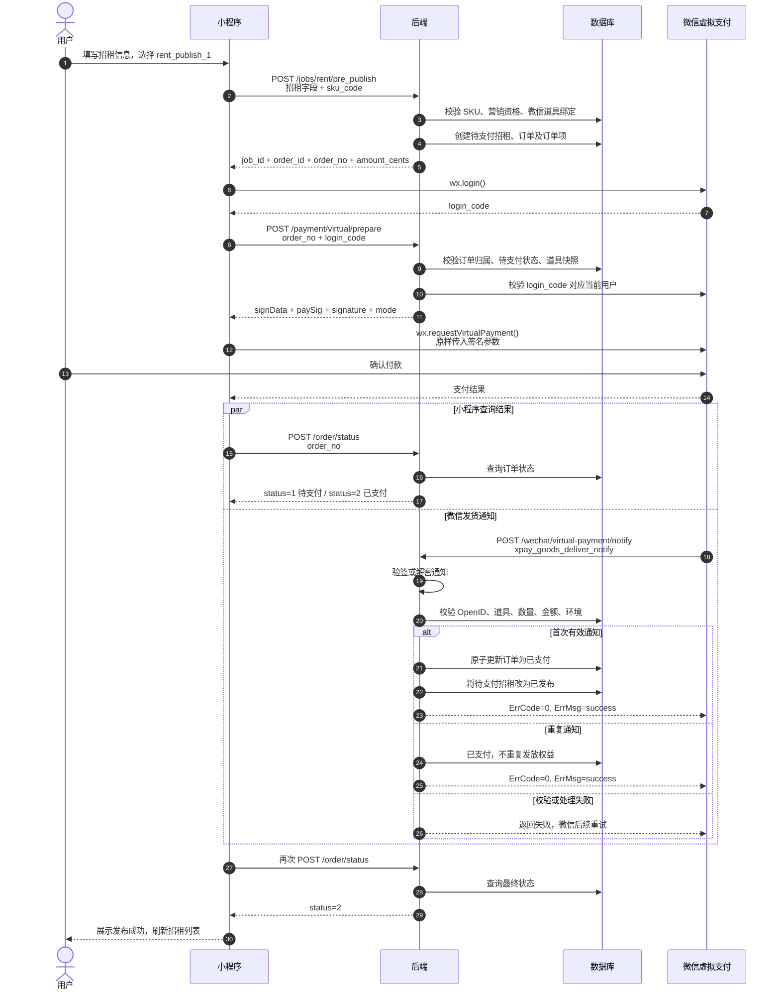

# 小程序虚拟支付接入说明

## 招租发布时序图

`/jobs/rent/pre_publish` 与 `/payment/virtual/prepare` 均由小程序主动调用；`/wechat/virtual-payment/notify` 仅由微信服务器调用。小程序应以 `/order/status` 返回 `status=2` 作为发布成功的最终依据。



## 1. 查询可购买 SKU

`POST /payment-packages/list`

服务端会自动过滤未上架、当前业务类型不适用、未绑定微信道具、当前用户不满足新用户/首购/限购规则的 SKU。

### 请求示例

```json
// 岗位置顶：仅招聘和求职可用
{ "product_code": "job_top", "biz_type": 1 }

// 联系券：与岗位类型无关
{ "product_code": "contact_voucher", "biz_type": 0 }

// 付费刷新：传被刷新的信息类型
{ "product_code": "paid_refresh", "biz_type": 3 }

// 招租发布
{ "product_code": "rent_publish", "biz_type": 3 }
```

### 响应示例

```json
{
  "code": 0,
  "data": {
    "product_code": "job_top",
    "product_name": "岗位置顶",
    "purchase_notice": "支付成功后立即生效。",
    "selection_mode": 2,
    "skus": [
      {
        "sku_code": "job_top_3d",
        "name": "置顶3天",
        "subtitle": "每天仅需3.3元",
        "badge": "推荐",
        "price_cents": 1000,
        "original_price_cents": 0,
        "benefit_config": {
          "top_hours": 72,
          "gift_contact_vouchers": 2
        }
      }
    ]
  }
}
```

- `selection_mode=1`：单规格，直接使用 `skus[0]`；无需展示多套餐选择器。
- `selection_mode=2`：多规格，展示 `skus` 并让用户选择一个 `sku_code`。
- `price_cents`、`original_price_cents` 只用于展示，提交订单时只传 `sku_code`。
- `skus=[]`：当前没有可购买套餐，隐藏购买按钮或展示“暂无可购买套餐”。

## 4. 创建业务订单

四个业务接口都只创建待支付订单，不直接拉起支付。成功后统一返回：

```json
{
  "order_id": 2001,
  "order_no": "TOP202608010001",
  "amount_cents": 1000
}
```

### 4.1 岗位置顶

`POST /jobs/top`

```json
{
  "job_id": 101,
  "sku_code": "job_top_3d"
}
```

仅支持招聘、求职信息；招租信息不可置顶。

### 4.2 联系券购买

`POST /contact_voucher/buy`

```json
{
  "sku_code": "contact_voucher_10"
}
```

### 4.3 付费刷新

`POST /jobs/refresh/pay`

```json
{
  "job_id": 101,
  "sku_code": "paid_refresh_1"
}
```

支持招聘、求职和招租信息。支付成功后刷新对应信息的付费刷新时间。

### 4.4 招租发布

`POST /jobs/rent/pre_publish`

该接口先创建待支付招租草稿，支付成功后由服务端自动发布。

```json
{
  "sku_code": "rent_publish_1",
  "positions": "临街餐饮店招租",
  "address": "北京市朝阳区示例路1号",
  "address_detail": "一层临街商铺",
  "longitude": 116.4074,
  "latitude": 39.9042,
  "contact": "13800138000",
  "contact_person_name": "张先生",
  "description": "适合早餐加盟、快餐等业态",
  "photo_urls": [
    "https://example.com/rent-1.jpg"
  ],
  "first_area_id": 1,
  "first_area_des": "北京市",
  "second_area_id": 2,
  "second_area_des": "朝阳区",
  "monthly_rent": 18000,
  "area_size": 80,
  "transfer_fee_type": 0,
  "transfer_fee_amount": 0,
  "transfer_desc": ""
}
```

`transfer_fee_type`：`0=无转让费`、`1=固定金额`、`2=面议`。当值为 `1` 时，`transfer_fee_amount` 必须大于 0。

成功响应比通用订单响应多一个 `job_id`：

```json
{
  "job_id": 101,
  "order_id": 2001,
  "order_no": "RENT202608010001",
  "amount_cents": 1800
}
```

未支付时该招租信息不可对外展示；支付成功并收到微信推送后自动变为已发布。

## 5. 准备并发起虚拟支付

### 5.1 获取本次支付登录 code

每次支付前重新调用 `wx.login`，不要复用登录时保存的 code：

```js
const { code } = await wx.login()
```

### 5.2 请求服务端签名

`POST /payment/virtual/prepare`

```json
{
  "order_no": "RENT202608010001",
  "login_code": "wx.login 返回的 code"
}
```

响应示例：

```json
{
  "code": 0,
  "data": {
    "order_no": "RENT202608010001",
    "amount_cents": 1800,
    "virtual_payment": {
      "signData": "{...}",
      "paySig": "...",
      "signature": "...",
      "mode": "short_series_goods"
    }
  }
}
```

### 5.3 调用微信支付

`signData` 是服务端签名原文，必须原样使用，不能 `JSON.parse` 后再序列化、不能修改字段。

```js
const prepare = await request({
  url: '/payment/virtual/prepare',
  method: 'POST',
  data: {
    order_no: orderNo,
    login_code: loginCode,
  },
})

const params = prepare.data.virtual_payment
await wx.requestVirtualPayment({
  signData: params.signData,
  paySig: params.paySig,
  signature: params.signature,
  mode: params.mode,
})
```

支付弹窗取消、失败或 API 抛错时，不应发放权益；可保留该订单号让用户稍后重新支付。

## 6. 确认最终支付结果

`wx.requestVirtualPayment` 的成功回调仅表示客户端支付流程完成，不能直接认为业务权益已经到账。最终状态以服务端订单为准。

`POST /order/status`

```json
{
  "order_no": "RENT202608010001"
}
```

```json
{
  "code": 0,
  "data": {
    "order_no": "RENT202608010001",
    "status": 2
  }
}
```

状态定义：

| status | 含义 | 小程序动作 |
|---|---|---|
| 1 | 待支付 | 短暂轮询；用户可重新发起支付 |
| 2 | 已支付 | 刷新业务页面并展示成功结果 |
| 3 | 已取消 | 展示订单已取消 |
| 4 | 已退款 | 展示退款结果，不再使用对应权益 |

建议在 `wx.requestVirtualPayment` 成功、取消或异常返回后都查询一次；若仍为待支付，可按 `1s、2s、3s、5s` 递增轮询，最长约 20 秒。超过时间仍待支付时展示“支付结果确认中”，允许用户主动刷新订单状态。

## 7. 服务端发货推送（小程序无需调用）

微信会向后端发送 `xpay_goods_deliver_notify`：

`POST /wechat/virtual-payment/notify`

服务端会校验消息签名、订单归属 OpenID、道具 ID、数量、实付金额及环境，并幂等发放权益：

| 商品 | 支付成功后的服务端动作 |
|---|---|
| 岗位置顶 | 增加置顶时长，发放赠送联系券 |
| 联系券 | 增加联系券余额并写流水 |
| 付费刷新 | 更新付费刷新时间 |
| 招租发布 | 将待支付招租信息发布 |

因此小程序不需要、也不能调用回调接口或自行修改订单状态。

## 8. 与旧版的差异

| 旧方式 | 新方式 |
|---|---|
| 业务接口返回 `pay_params` | 业务接口返回 `order_no`、`amount_cents` |
| 调用 `wx.requestPayment` | 调用 `wx.requestVirtualPayment` |
| 客户端依据支付回调更新页面 | 通过 `/order/status` 确认最终状态 |
| 客户端可见普通支付参数 | 只获得虚拟支付签名参数 |

## 9. 测试环境提示

- Android、鸿蒙可使用虚拟支付沙箱：后端须配置沙箱 `OfferID`、`AppKey`、发货推送 Token，并使用 `env=1`。
- iOS 不支持虚拟支付沙箱，需要在正式环境完成验证。
- 每个 SKU 都必须在微信虚拟支付后台创建并发布道具，且后台 SKU 已填写对应微信道具 ID；否则该 SKU 不会出现在小程序套餐列表中。
